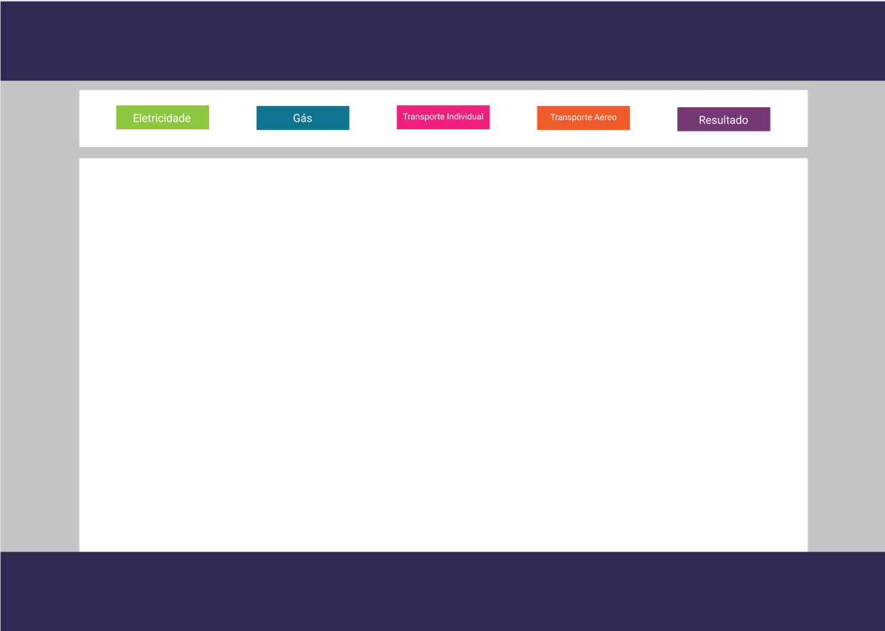
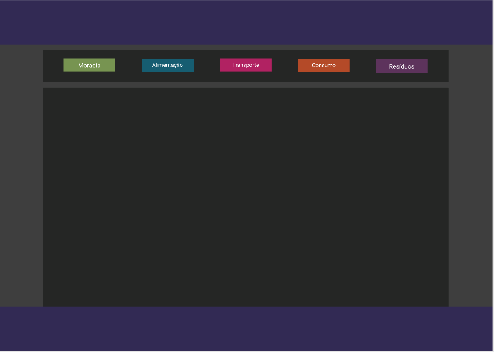

# Projeto Intregrador

## Justificativa

## Layout
As páginas na versão desktop, seguirão o seguinte padrão

### cores 

* Cinza #c4c4c4 <label style="background-color: #c4c4c4; color: #000"> #c4c4c4</label>
* Branco <label style="background-color: #ffffff; color: #000"> #ffffff</label>
*  Azul Escuro <label style="background-color: #322a54"> #322a54</label>
* Verde do botão eletricidade <label style="background-color: #a6ce39 ; color: #000"> #a6ce39</label>
* Azul do botão Gás <label style="background-color: #0f7491"> #0f7491</label>
* Rosa do botão Transporte coletivo <label style="background-color: #ed217c"> #ed217c</label>

* Laranja do botão transporte aéreo <label style="background-color: #f15a29"> #f15a29</label>

* Roxo do botão Resultado
<label style="background-color: #753874"> #753874</label>

## Modo Escuro

### cores do modo escuro

* Fundo do site <label style="background-color: #3E3E3E"> #3E3E3E</label>

* Fundo do cabeçalho <label style="background-color: #252625"> #252625</label>
